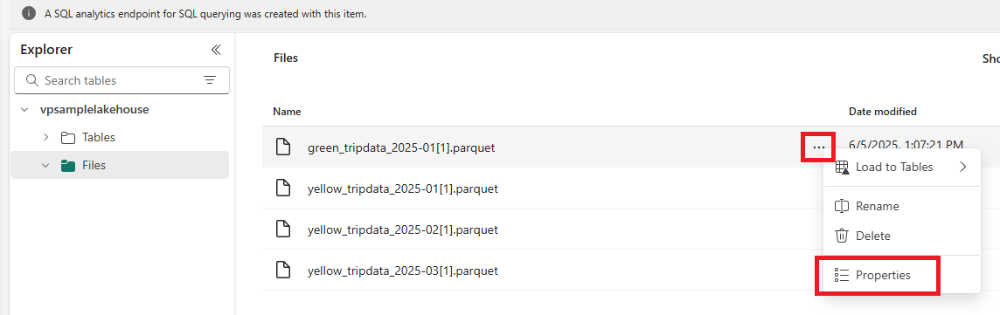
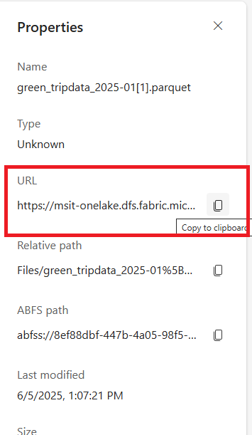
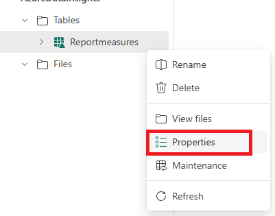
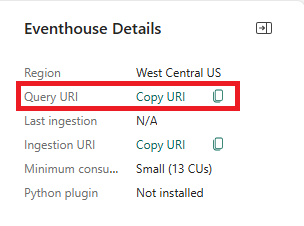
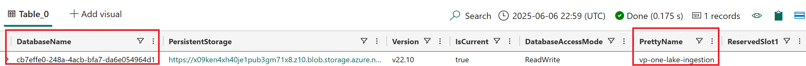
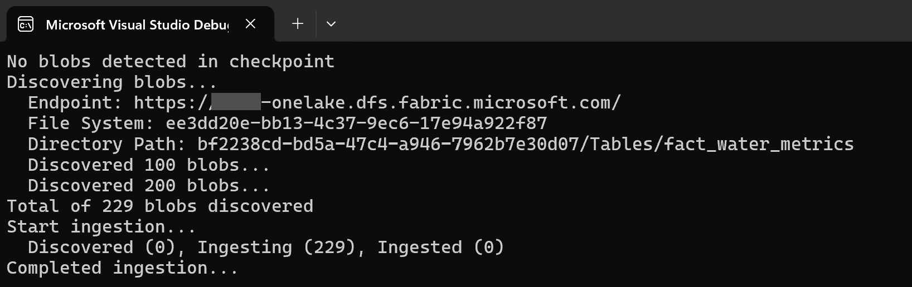

# one-lake-kusto-ingestion (olki)

Stop gap to perform an historical load from Microsoft OneLake to Eventhouse / Azure Data Explorer

##  What is this solution?

Olki is a Command-Line-Interface (CLI) tool enabling the ingestion of arbitrarily large amount of blobs from [Fabric OneLake](https://learn.microsoft.com/en-us/fabric/onelake/onelake-overview) into a Kusto cluster, either [Fabric Eventhouse](https://learn.microsoft.com/en-us/fabric/real-time-intelligence/eventhouse) or [Azure Data Explorer](https://learn.microsoft.com/en-us/azure/data-explorer/data-explorer-overview).

This is a temporary / stop gap solution until massive ingestion from OneLake is supported.  As such its **feature set is limited**.

##  Getting started

### Azure CLI authentication

You can [download the CLI here](https://github.com/microsoft/one-lake-kusto-ingestion/releases).  It is a single-file executable available for Linux, Windows & MacOS platform.

Olki's authentication uses Azure CLI authentication.  You need to [install Azure CLI](https://learn.microsoft.com/en-us/cli/azure/install-azure-cli) and authenticate against the OneLake's tenant using [az login](https://learn.microsoft.com/en-us/cli/azure/authenticate-azure-cli).

### OneLake root folder

You need to find the root folder containing the blobs you want to ingest.

If your files are located in a Fabric Lakehouse, you can choose one of the files you which to ingest:



and then copy its URL:



From the blob URL, removing the actual name of the blob, you should have the folder URL.

Similarly, if you want to ingest the blobs from one of the Delta Tables, you can select properties:



And copy its URL.

### Eventhouse URL

Now that you have the source information, i.e. the OneLake folder, let's move to the destination, i.e. Eventhouse.  Let's start by the Eventhouse URL.

In your Eventhouse overview page, on the right pane, you should see:



Copy that value.

### Eventhouse Database

The name you give an Eventhouse database is its *pretty name*.  We need its real name.  You can find that out by running [.show databases](https://learn.microsoft.com/en-us/kusto/management/show-databases):



The name you gave your database is in the `PrettyName` column while the name you need to copy is in the `DatabaseName` column.

In this example there is only one database, if you have many, select the database name corresponding to the database you want to ingest into.

### Eventhouse Table

Finally we need the name of the table to ingest into.

> Note:  You need to [pre-create the table](https://learn.microsoft.com/en-us/kusto/management/create-table-command) you want to ingest into.  If you need a data mapping to ingest the blobs, you also need to define it at this point.

If you do not know want schema your table should have to ingest the blobs, you can use [infer_storage_schema plugin](https://learn.microsoft.com/en-us/kusto/query/infer-storage-schema-plugin) on one of the blobs you want to ingest (use [impersonation authentication](https://learn.microsoft.com/en-us/kusto/api/connection-strings/storage-connection-strings#impersonation)).

### Invoking the CLI

At this point, you have:

*   Installed Azure CLI
*   Ran `az login` to authenticate yourself
*   Retrieved the OneLake root folder you want to ingest
*   Retrieved the Eventhouse URL
*   Retrieved the Eventhouse Database name
*   Created a table in your database to ingest the data

You are now ready to execute olki.  Here are the CLI arguments:

Name|Switch|Mandatory|Example|Description
-|-|-|-|-
Directory|-d|:white_check_mark:|https://contoso-onelake.dfs.fabric.microsoft.com/8ef88dbf-447b-4a05-98f5-7a3ac10794c3/33f46a7b-3b17-4cc2-9e71-18b1b67a1978/Files|OneLake root folder
Suffix|-s|:x:|.parquet|Filter for the end of the blob name ; this is typically used to exclude non-data files (e.g. log files)
Table uri|-t|:white_check_mark:|https://trd-vhr2crdnartx3qbfeb.z4.kusto.fabric.microsoft.com/cb7effe0-248a-4acb-bfa7-da6e054964d1/Taxis|Concatenation of the Eventhouse URL, the database name and the table name.  In the example, `Taxis` is the Kusto table name and `cb7effe0-248a-4acb-bfa7-da6e054964d1` is the database name.
Format|-f|:white_check_mark:|parquet|[Ingestion format](https://learn.microsoft.com/en-us/azure/data-explorer/ingestion-supported-formats)
Mapping|-m|:x:|parquet|Name of the [data mapping](https://learn.microsoft.com/en-us/kusto/management/mappings) defined in the destination table for the given ingestion format

### Examples

The following command defines a suffix but no data mapping:

```
./olki -d https://contoso-onelake.dfs.fabric.microsoft.com/8ef88dbf-447b-4a05-98f5-7a3ac10794c3/33f46a7b-3b17-4cc2-9e71-18b1b67a1978/Files/ -s ".parquet" -t https://trd-vhr2crdnartx3qbfeb.z4.kusto.fabric.microsoft.com/cb7effe0-248a-4acb-bfa7-da6e054964d1/Taxis -f parquet
```

### How this should run

Olki should first run a "discovery phase" where it will list the blobs to ingest and will then start ingesting them.



Ingestion progress will be reported with the following quantities:

*   Discovered:  number of blobs discovered but not yet processed
*   Ingesting:  number of blobs sent for ingestion
*   Ingested:  number of blobs confirmed as ingested

### Checkpoint file

You will notice a file named `checkpoint.json` created in the folder you run Olki.  This file checkpoints the operations so that if something goes wrong and the process stops, you can restart it and it will remember where it was at.

> Note:  Olki doesn't use queued ingestion.  It sends ingestion commands directly to the Kusto engine and waits for completion before sending more.  Because of that, the process must run for the ingestion to occur.  Although you can stop the process and restart it, after a while operation ids might disapear from your database which could cause data duplication.  For that reason we recommend not to stop the process for too long.
